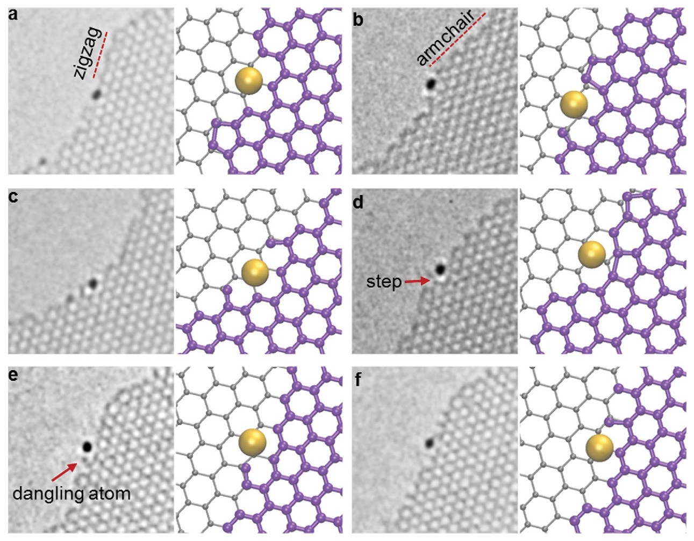
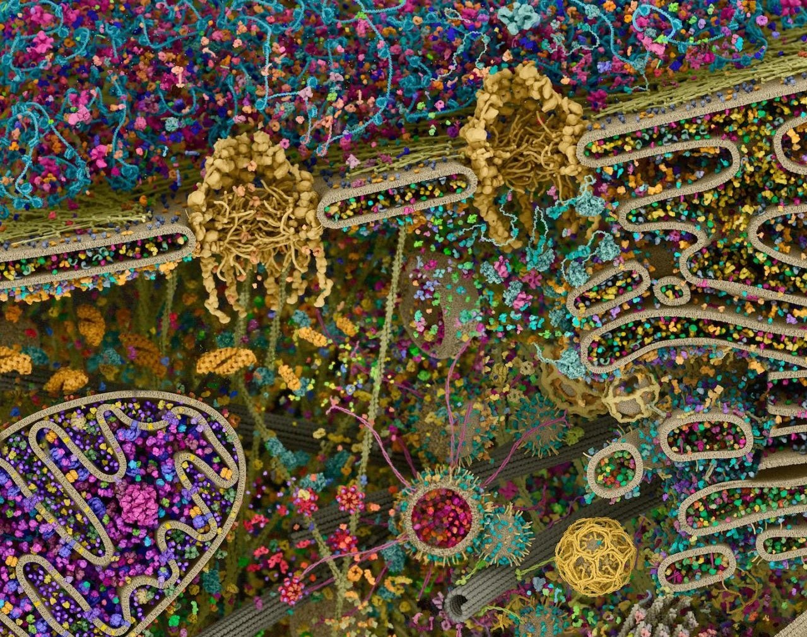
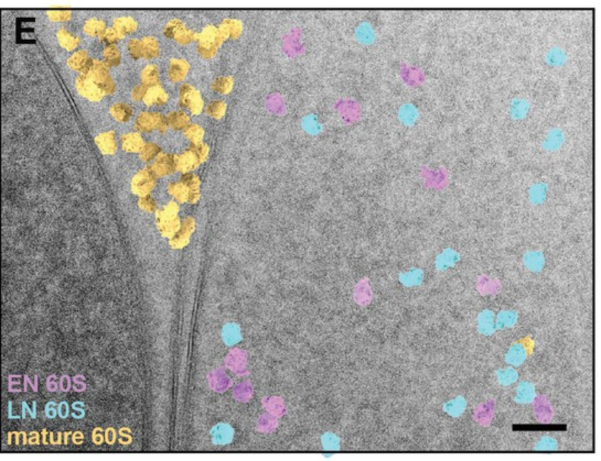

# Cryo-EM imaging of biomolecular complexes in their native environment

From the rare mechanosensory transduction complex to the abundant ribosome

### Johannes Elferich

### 10/19/2022

---

# Why Cryo-TEM?

::left::

- Electrons can be accelerated to hundreds of keV, wavelength that are much
  smaller than atomic radii, thereby allowing high resolution

- Electrons can be manipulated using electric and magnetic fields, making it possible to generate real-space images from diffraction

::right::

Single gold atom at the edge of a graphene sheet [Wang et.al., Nanoscale 2012]

---

::left::

# Expectiation

Illustration by David S. Goodsell

::right::

# Reality

- High energy electrons rapidly damage biological samples and biomolecules have very little contrast 

- No 3D, just a projection

- Small field of view

---
clicks: 5
---
# How single-particle cryo-EM overcomes these challenges

::left::

Real space

<arrow x1="380" y1="200" x2="580" y2="200" color="green" width="3" />
<arrow x1="580" y1="240" x2="380" y2="240" color="green" width="3" />

<Videoi src="/ribo_video.webm" class="h-200px mx-auto mt--20px" autoplay v-if="$slidev.nav.clicks===5"></Videoi>

<Videoi src="/projection_video.webm" class="h-150px mx-auto mt-10px " autoplay v-if="$slidev.nav.clicks===5"></Videoi>

<arrow x1="380" y1="400" x2="580" y2="400" color="green" width="3" v-after />
<arrow x1="580" y1="440" x2="380" y2="440" color="green" width="3" v-after />

::right::

Fourier space

<Videoi src="/slices_video.webm" class="h-200px mx-auto " autoplay v-if="$slidev.nav.clicks===5"></Videoi>

---

# Hearing background

<stereocilia-animation></stereocilia-animation>

---

# Proteins of mechanotransduction

[Fettiplace, Is TMC1 the Hair Cell Mechanotransducer Channel? Biophysical Journal, 2016]

---

# How to image stereocilia using cryo-EM

<cite>Metlagel Z, Krey JF, Song J, Swift MF, Tivol WJ, Dumont RA, Thai J, Chang A, Seifikar H, Volkmann N, Hanein D, Barr-Gillespie PG, Auer M. Electron cryo-tomography of vestibular hair-cell stereocilia. J Struct Biol. 2019 May 1;206(2):149-155</cite>

---
clicks: 4
---
# Tomography background

<Videoi  loop class="w-auto h-430px" src="/tomo_ex.mp4#t=0.6" :from="from" :to="to"></Videoi>

XY

ZY

XZ

---

# There are filaments on stereocilia

---

# Labeling with antibodies

---

# Labeling Pcdh15 with 39G7 AuNP 

<cite >Azubel, M., Carter, S. D., Weiszmann, J., Zhang, J., Jensen, G. J., Li, Y., & Kornberg, R. D. (2019). FGF21 trafficking in intact human cells revealed by cryo-electron tomography with gold nanoparticles. In eLife (Vol. 8).  </cite>

---
Id: custom
---

<Video src="/labeled_movie.mp4" loop autoplay class="z--1">
</Video>

<h1 class="text-white m-0.5rem mb-0.5rem -ml-1rem">Detection in-situ</h1>

---

# Two AuNP labels consistent with Pcdh15 dimers

---

# One AuNP label - monomer? 

::left::

::right::

---

# Pcdh15 numbers at the tip

::left::

::right::

---
clicks: 3
---

<Video src="/movie3.mp4" class="h-full" v-if="$slidev.nav.clicks<2"></Video>

1">

<Videoi src="/Video1.mp4" class="h-250px mt-130px ml-20px" v-if="$slidev.nav.clicks>2"></Videoi>

---

# Summary

<ul>
<li>Immuno-AuNPs detection of rare protein complexes in cryo-EM tomograms
<ul>
<li>Location</li>
<li>Numbers</li>
<li>Conformation</li>
<li>Structure?</li>
<li>But: For know only extracellular</li>
</ul>
</li>

<li v-click>Tip-links might occur with more than one copy at the tip, similar to channels</li>
<li v-click>Pcdh15 has a predetermined bending point to adopt to geometry required for trafficking</li>
</ul>

---

# Hematopoiesis and Ribosompathies

::left::

::right::

[Ruggero and Shimamura, Marrow failure: a window into ribosome biology,  Blood, 2014]

---

# Ribosomopathies hypotheses

---
layout: video
background: '#000000'
clicks: 2
class: text-white
---
# 2D Template Matching

<Videoi src="/2dtm.mp4" class="h-400px mx-auto" :from="from" :to="to"></Videoi>

[Cryo-EM data collected by Johannes Elferich using Titan Krios microscope on Gatan K3 camera]

[Background data collected by Nikolaus Grigorieff using Astro-Tech AT111EDT 111mm f/7 ED
triplet apochromatic refractor on Canon Digital Rebel XSi camera]

---

# 2DTM 

---

# ER-HoxB8 cells

---
layout: video
background: '#000000'
clicks: 2
class: text-white
---
# Cryo-FIB: Cutting windows into cells

<Videoi src="/milling.webm" class="h-full z--1" :from="from" :to="to" ></Videoi>

---

# Lamella and what they look like

::left::

Undifferentiated

::right::

Differentiated

---

# Inital matching

---
clicks: 3
---

# Why and how DeCo-LACE

---
clicks: 5
---

<h1 class="text-white">DeCo-LACE data</h1>

<Video src="/assembly.webm" v-if="$slidev.nav.clicks === 5" autoplay class="-z-1" ></Video>

---

# Does DeCo-LACE provide high-resolution data

---
clicks: 7
layout: video
background: '#000000'

---
<Video src="/movie2.mp4" class="h-full" :from="from" :to="to"></Video>

---

# What can we do? - Count

---
clicks: 2
---
# What can we do? - Measure rotations

::left::

::right::

<Videoi src="/movie5.mp4" autoplay v-if="$slidev.nav.clicks == 1"></Videoi>
<Videoi src="/movie6.mp4" autoplay v-if="$slidev.nav.clicks == 2"></Videoi>

---
clicks: 2
---

# What can we do? - Reconstruct and classify

::left::

<Videoi src="/rec1.mp4" autoplay v-if="$slidev.nav.clicks === 0"></Videoi>
<Videoi src="/rec2.mp4" autoplay v-if="$slidev.nav.clicks === 1"></Videoi>
<Videoi src="/rec2.mp4" v-if="$slidev.nav.clicks === 2"></Videoi>
::right::

---

# Summary

---

# Future plans

- Ribosomopathies

- Hematopoietic stem cells mobilization

- Metastasis

---

# Acknowledgments
